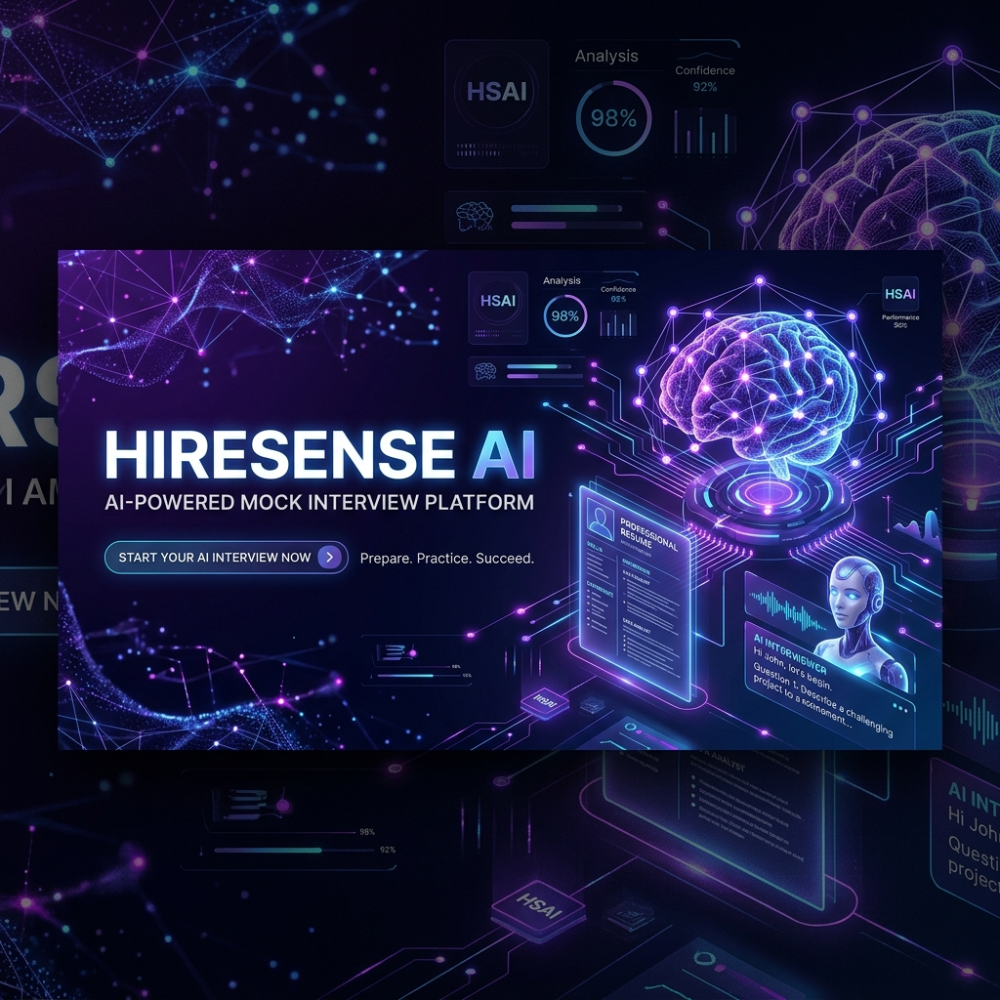
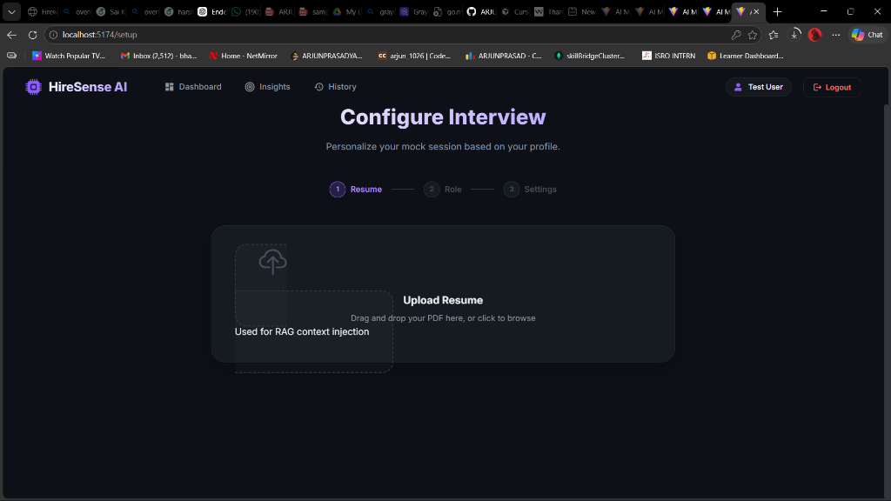
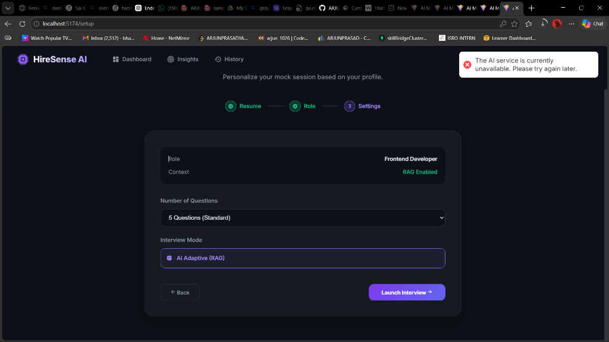
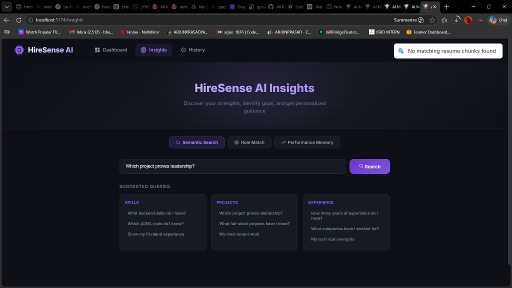
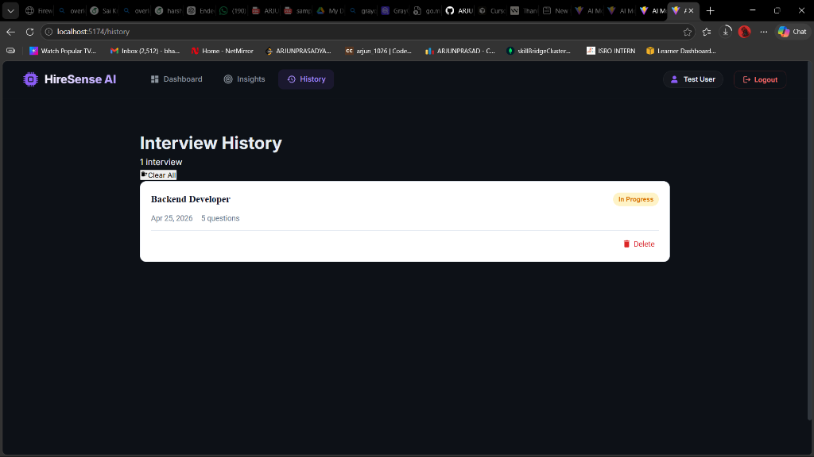
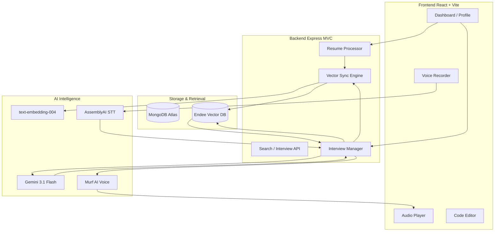

# HireSense AI — AI-Powered Mock Interview Platform



HireSense AI is a production-grade mock interview platform designed to elevate the job-seeking experience through semantic intelligence. By leveraging **Endee Vector Database** for long-term memory and **Gemini 3.1 Flash** for advanced reasoning, HireSense provides a deeply personalized, conversational interview experience that evolves with the user.

## 📸 Platform Gallery

<table align="center">
  <tr>
    <td align="center"><br/><sub><b>Modern Authentication</b></sub></td>
    <td align="center"><br/><sub><b>Intelligent Dashboard</b></sub></td>
  </tr>
  <tr>
    <td align="center"><br/><sub><b>Semantic Profile Management</b></sub></td>
    <td align="center"><br/><sub><b>Real-time AI Interview</b></sub></td>
  </tr>
  <tr>
    <td align="center" colspan="2"><br/><sub><b>Semantic Search & Role Analytics</b></sub></td>
  </tr>
</table>

## ✨ Key Features

- **🎯 Semantic Profile Intelligence**: A dedicated profile management system that indexes resumes into **Endee Vector Database** using 768-dimensional embeddings for high-precision retrieval.
- **🧠 RAG-Powered Interviewing**: Implements **Retrieval-Augmented Generation** to inject real-world resume context into interview prompts, ensuring questions are specifically tailored to your actual projects and skills.
- **📈 Multi-Factor Role Matching**: Calculates a "Combined Role Fit" score by merging initial resume semantic analysis (40%) with actual interview performance metrics (60%).
- **🗣️ Human-Centric Voice Flow**: Natural conversational interface powered by **Murf AI (TTS)** and **AssemblyAI (STT)**, allowing for seamless voice-to-voice mock interviews.
- **🔄 AI Memory Engine**: Tracks performance trends across multiple sessions, detecting recurring weak areas and adapting future question difficulty accordingly.
- **💻 Integrated Coding Environment**: Built-in code editor for technical rounds with real-time AI evaluation and feedback on code quality, correctness, and efficiency.

## 🏗️ Architecture & Workflow

HireSense AI utilizes a sophisticated RAG architecture to bridge the gap between static resume data and dynamic interview conversations.



### 1. The Indexing Lifecycle
When a user uploads a resume, the **Resume Service** performs semantic chunking. These chunks are transformed into vectors and stored in **Endee**, creating a searchable "knowledge base" of the user's professional history.

### 2. The Personalized Prompting Phase
Unlike standard mock tools, HireSense doesn't just ask random questions. It queries the **Endee Vector DB** for the most relevant "Experience Chunks" based on the target role, injecting this ground-truth data into the AI's prompt.

### 3. The Feedback Loop
Post-interview, the system analyzes the conversation history stored in MongoDB, calculates the **Combined Role Match**, and updates the user's "Weak Areas" memory to optimize future practice sessions.

## 🛠️ Technology Stack

- **Frontend**: React.js 18, Vite, Vanilla CSS (Custom Glassmorphism Design System)
- **Backend**: Node.js, Express.js
- **Database**: MongoDB (Structured Metadata) + Endee Vector Database (Semantic Knowledge)
- **AI Models**: 
  - **Generative**: Google Gemini 3.1 Flash-Lite
  - **Embeddings**: Google text-embedding-004
  - **Voice**: Murf AI (Natalie Voice Model)
  - **Transcription**: AssemblyAI

## 🔧 Setup Instructions

### Prerequisites
- Node.js (v18+)
- MongoDB Atlas Instance
- Endee API Key ([app.endee.io](https://app.endee.io))
- Google Gemini API Key ([aistudio.google.com](https://aistudio.google.com))

### Installation
1. **Clone the repository**
2. **Backend Configuration**:
   ```bash
   cd server
   npm install
   # Create .env and add:
   # PORT, MONGODB_URI, GEMINI_API_KEY, ENDEE_API_KEY, MURF_API_KEY
   npm run dev
   ```
3. **Frontend Configuration**:
   ```bash
   cd client
   npm install
   npm run dev
   ```

## 📊 Endee Index Configuration
- **Resume Index**: `resume_chunks` (768 dimensions)
- **Memory Index**: `interview_memory` (768 dimensions)
- **Search Metric**: Cosine Similarity

---

Developed with ❤️ for the **Endee + MongoDB AI Hackathon**.
