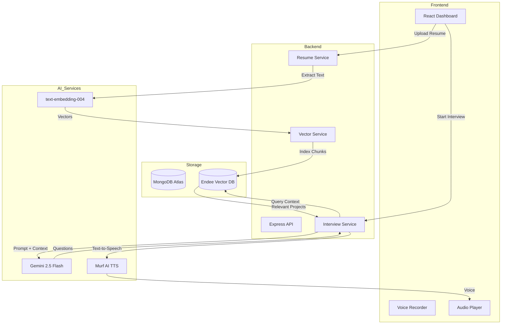

# HireSense AI — AI-Powered Mock Interview Platform

HireSense AI is a production-grade mock interview platform designed to help students and job seekers ace their technical interviews. By leveraging **Endee Vector Database** and **Gemini AI**, HireSense provides a personalized, context-aware interview experience that simulates real-world hiring processes.

## 🚀 Key Features

- **Semantic Resume Intelligence**: Upload your resume and let our AI index it into **Endee Vector Database** for semantic retrieval.
- **RAG-Powered Personalization**: Questions are dynamically generated based on your specific projects, skills, and experience extracted from your resume.
- **AI Memory Engine**: The platform tracks your performance across sessions, identifying weak topics and focusing future interviews on areas that need improvement.
- **Conversational AI Interviewer**: Experience a natural flow with **voice-enabled** questions and real-time follow-ups using Murf AI and AssemblyAI.
- **Detailed Feedback Analytics**: Receive comprehensive score cards on communication, technical depth, and problem-solving with actionable improvement tips.

## 🏗️ Architecture & Workflow

HireSense AI uses a clean MVC architecture and a robust **Retrieval-Augmented Generation (RAG)** pipeline to ensure every interview is unique to the candidate.

### 1. Resume Indexing Phase
When a user uploads a PDF, the system parses the text, splits it into semantic chunks, generates 768-dimensional embeddings using Gemini, and stores them in **Endee Vector Database** with metadata.

### 2. Interview Generation Phase
Upon launching an interview, the system queries Endee for the candidate's most relevant projects and skills for the target role. This context is injected into the Gemini 2.5 Flash prompt, ensuring questions are highly personalized.

### 3. Real-time Feedback Phase
As the user answers, the AI evaluates the response, extracts weak topics, and indexes them into an `interview_memory` index in Endee to personalize future sessions.

## 🛠️ Technology Stack

- **Frontend**: React.js, Vite, Vanilla CSS (Premium Dark Theme)
- **Backend**: Node.js, Express.js
- **Database**: MongoDB (Structured Data) + Endee Vector Database (Vector Data)
- **AI Services**: Google Gemini (LLM + Embeddings), AssemblyAI (STT), Murf AI (TTS)

## 🔧 Setup Instructions

### Prerequisites
- Node.js (v18+)
- MongoDB Atlas account
- Endee API Key ([app.endee.io](https://app.endee.io))
- Google Gemini API Key ([aistudio.google.com](https://aistudio.google.com))

### Backend Setup
1. `cd server`
2. `npm install`
3. Create `.env` from `.env.example` and fill in your keys.
4. `npm run dev`

### Frontend Setup
1. `cd client`
2. `npm install`
3. `npm run dev`

## 📊 Endee Index Configuration
- **Resume Index**: `resume_chunks` (Dimension: 768)
- **Memory Index**: `interview_memory` (Dimension: 768)
- **Metric**: Cosine Similarity

---

Developed with ❤️ for the **Endee + MongoDB Hackathon**.
